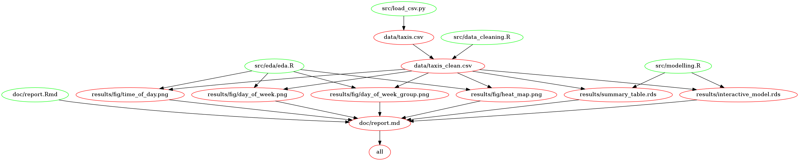

# Inferential Analysis between Time of Day and Day of the Week on Tip Percentage for Taxi rides in New York City

## Authors
- Alexander Hinton
- Mengzhe Huang
- Yijia Qin 

## Summary
The research question for this data analysis project is whether the time of day, and day of the week are associated with tip generosity of riders in New York City taxis. Taxi drivers often have autonomy in there working schedules, and would be interested in which times of the day and week are associated with the highest average tip percentages, and whether these differences are significant.

The original source of our data is [New York Open Data](https://data.cityofnewyork.us/Transportation/2017-Yellow-Taxi-Trip-Data/biws-g3hs), which provides a comprehensive dataset of all taxi rides in New York City. We have used a [sample](https://raw.githubusercontent.com/jamesh4/yellow_tripdata_2017_02/master/taxi_smaller.csv) of 1 million rides from this dataset, from the month of February 2017.

After an [Exploratory Data Analysis](https://github.com/UBC-MDS/DSCI522_GR406/blob/master/src/eda/eda.ipynb) on our dataset, we fit an interactive linear model using the mean tip percentage as our independent variable. Statistically significant associations between time of day and  differences in mean tip percentage were found, while controlling for a handful of potential confounders. 

## Report
The final report can be read [here](https://github.com/UBC-MDS/DSCI522_GR406/blob/master/doc/report.md).

## Usage and flowchart
There are three ways to run the analysis on your local machine. The first step is to clone this repository. The first method requires installation of Docker and the rest two methods require all dependencies to be installed before running the analysis.

#### Method 1: Using Docker
Note - the instructions below depends on running this in a unix shell (e.g., terminal or Git Bash), if you are using Windows Command Prompt, replace /$(pwd) with PATH_ON_YOUR_COMPUTER.

1. Install and run [Docker](https://www.docker.com/get-started)
2. Navigate to the root of this repo and type the following commands:
```
docker run -it --rm -v /$(pwd):/home/DSCI522_GR406 jamesh4/dsci522_gr406 make -C /home/DSCI522_GR406 all
```
3. To undo the analysis, type the following commands:
```
docker run -it --rm -v /$(pwd):/home/DSCI522_GR406 jamesh4/dsci522_gr406 make -C /home/DSCI522_GR406 clean
```

#### Method 2: Using Make
From the root of this project directory, run the command: <br>
```
make all
```
To remove all the results of the analysis, run the command: <br>
```
make clean
```

#### Method 3: Using the command line
To run each script independently, run the following commands in order from the root directory of the project: <br>

```
# download data from web
python src/load_csv.py https://raw.githubusercontent.com/jamesh4/yellow_tripdata_2017_02/master/taxi_smaller.csv data/taxis.csv

# clean and process the data
Rscript src/data_cleaning.R data/taxis.csv data/taxis_clean.csv

# create EDA visualizations
Rscript src/eda/eda.R data/taxis_clean.csv results/fig/

# statistical modelling
Rscript src/modelling.R data/taxis_clean.csv results/

# generate report
Rscript -e "rmarkdown::render('doc/report.Rmd')"
```

#### Makefile structure:



#### Flowchart:


### Dependencies
- R version 3.6.1 and R packages:
    - MASS		7.3 - 51.4
    - tidyverse	1.3.0
    - broom		0.5.2
    - repr		1.0.2
    - modelr	0.1.5
    - ggplot2	3.2.1
    - gridExtra	2.3
    - ggridges	0.5.1
    - GGally	1.4.0
    - docopt	0.6.1
    - RCurl		1.98 -  1.1
- Python version 3.7.3 packages:
    - docopt     0.6.2
    - pandas     0.24.2
    - validators 0.14.2
    
#### References
1. New York City Open Data, 2017 Yellow Taxi Trip Data, https://data.cityofnewyork.us/Transportation/2017-Yellow-Taxi-Trip-Data/biws-g3hs 

2. Data.World Open Data, Yellow Trip Data February 2017, https://data.world/new-york-city/yellow-tripdata-february-2017
