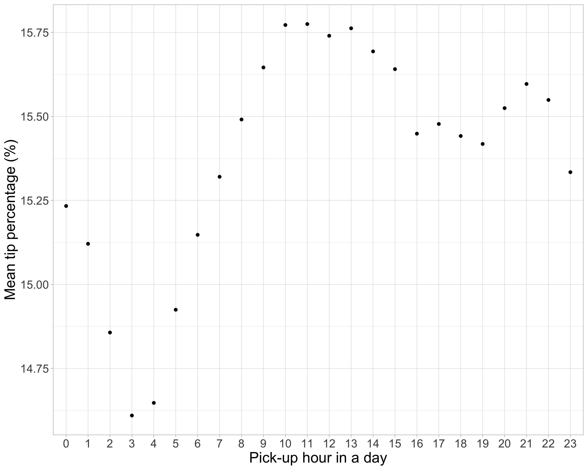
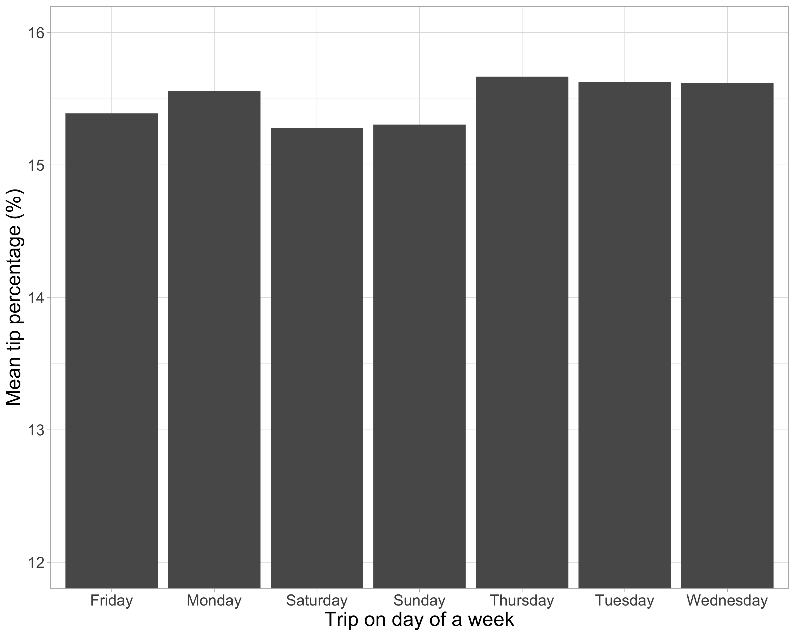
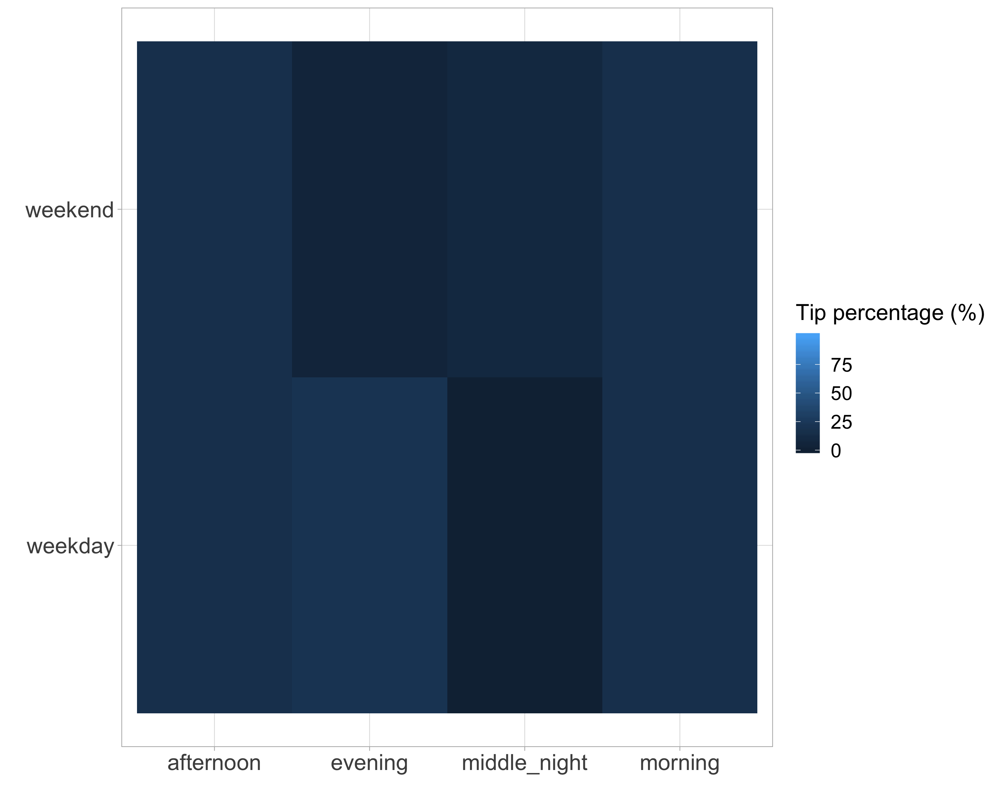

Inferential Analysis on Time of Day and Tip Percentage for Taxi Rides in New York City
================
Alexander Hinton, James Huang, Jasmine Qin

-   [Introduction and Aims](#introduction-and-aims)
-   [Data](#data)
    -   [Datasource](#datasource)
    -   [Wrangling and Exploratory Data Analysis](#wrangling-and-exploratory-data-analysis)
-   [Model](#model)
-   [Results](#results)
-   [Discussion](#discussion)
    -   [Statistical significance](#statistical-significance)
    -   [Magnitudes](#magnitudes)
    -   [Credits](#credits)
-   [References](#references)

Introduction and Aims
=====================

In this data analysis project, we are trying to answer the question of whether the time of day, and day of the week are associated with tip generosity of riders in New York City taxis. This is an important question for taxi drivers, who often have autonomy on there working schedules and therefore may find it interesting which times of the day and week are associated with the highest average tip percentages, and whether these differences are significant.   Additionally, this analysis is interesting on the study of human behaviour, further understanding tipping behaviour. Our aim for the project will be to perform an `Inferential` analysis, and to estimate association between our independet variables of interest (time of the day, and day of the week), and our outcome variable (tip percentage). Our aim is not to make a causal or mechanistic claim between any variables, however this would be an interesting area for future work. follow up project.

Data
====

Datasource
----------

We are using a comprehensive dataset of all taxi rides from yellow and green cabs in New York City for the month of February, 2017. The dataset was downloaded from [data.world](https://data.world/new-york-city/yellow-tripdata-february-2017/workspace/file?filename=yellow_tripdata_2017-02.csv), and provided to them by the City of [New York Open Data Portal](https://opendata.cityofnewyork.us/), which provides all New York City public data, based on the [New York City open data law](https://opendata.cityofnewyork.us/open-data-law/).   The data provides many features about each observation, including: 

---&gt; Pickup and dropoff time stamps  ---&gt; Pickup and dropoff location Id's  ---&gt; Distance and duration of each trip  ---&gt; Fare  ---&gt; Tip  ---&gt; Payment method 

The dataset could not be downloaded directly with a url, and thus had to be reuploaded to a github repo. The size of the file greatly exceeded the 100 MB size limit of github uploads, so the data was randomly sampled to include 1M observations from the original 9M observations. The location of the file we are using in the analysis can be found and downloaded [here](https://raw.githubusercontent.com/jamesh4/yellow_tripdata_2017_02/master/taxi_smaller.csv).

Wrangling and Exploratory Data Analysis
---------------------------------------

For our problem, we have created an additional variable called of **tip percentage**, which is calculated as:
$$\\frac{\\text{tip}}{\\text{total fare}}\*100$$
. This transformation was carried out for the main reason that most individuals tip not in absolute terms but in percentages, and therefore a gross value of tip is extremely correlated with the ride fare. When using a credit or debit card to make a transaction, the tip option is usually specified as a percentage, making it most logical that we use tip percentage as our dependent variable.   We have mapped location ID's from the dataset into their unique boroughs in New York City. The link to this dataset can be found here (Where is link?).  By reducing the location ID's to 5 from over 200 we are improving the parameter estimates in the modelling, as well as making them more interpretable.   We have only included rides where payment was made with a credit card, as these are the only rides where the tip amounts were recorded.

To further understand the data, we first visualized if there was a relationship between hour of the day, and the mean tip percentage.

Figure 1. Mean tip percentages by hour.

 As well as how mean tip percentage vary over a week. 

Figure 2. Mean tip percentages by day.

From the visual inspection, and based on the analysis we wanted to carry out, we decided to transform our time feature. Currently all rides are recorded with a timestamp, however for our inferential analysis we wanted to compare make comparisons between different "time of day" groups". We broke down a 24 hour day into the following four segments: 

---&gt; Morning: rides between 5:00am and 11:59am   ---&gt; Afternoon: rides between 12:00pm and 5:59pm   ---&gt; Evening: rides between 6:00pm and 9:59pm   ---&gt; Middle of the night: rides between 10:00pm and 4:59am  

These groups contain an approximately equal proportion of the rides, and could also be considered as shifts that a taxi cab driver might work. Additionally, we have also created an indicator variable for weekend vs. weekday rides, as it appeared there might be a relationship there. A final heat map of mean tip percentages split on our time of day feature, and weekend/weekday feature can be seen below:  

Figure 3. Heatmap

From the heatmap we can see that tip percentages are highest in the afternoon/evening, and that the relationship between time of day and tip percentage is different between weekends and weekdays. This information means we should likely fit an interactive term between time of day and day of the week.

Model
=====

{Aside: reference for this section is Art of Data Science book}  The question we are asking is whether there is an association between time of day, and the mean tip percentage for taxi rides in New York City. Before we set up the model, we need to carefully consider our problem and our relevant variables:  **Outcome**: This is our `tip percentage` variable   **Key predictor**: This is our variable of interest, the `time of day` group variable which we have outlined above. We want to know the Outcome variable changes with this key predictor.   **Confounders**: Potential variables related to both the `Key Predictor` variable, and the `Outcome` variable. We will control for the following potential confounding variables: `ride location` (borough), `trip distance`, and `number of passengers`.  

Given this breakdown, wee estimated the following linear model:    
*y* = *α* + *γ* \* *z* + *β*1 \* time of day + *β*2 \* weekday + *β*3 \* time of day \* weekday + *ϵ*
   Where  are the potential confounding variables we are controlling for,  are the estimates of the parameters associated with those counfounders, and  are the estimates of the parameters we are interested in. Of note, we have fit an interaction model between time of day and day of week, based on the visual inspection of the heatmap above.

Results
=======

The results of our model are outputted below:  

| term                                                         |     estimate|    p.value|
|:-------------------------------------------------------------|------------:|----------:|
| (Intercept)                                                  |   11.3639098|  0.0000000|
| trip\_distance                                               |   -0.5718536|  0.0000000|
| total\_amount                                                |    0.1290350|  0.0000000|
| PUBoroughBrooklyn                                            |    3.8107272|  0.0000000|
| PUBoroughEWR                                                 |  -10.3295247|  0.0000000|
| PUBoroughManhattan                                           |    3.6565577|  0.0000000|
| PUBoroughQueens                                              |    4.5231453|  0.0000000|
| PUBoroughStaten Island                                       |   -3.0086196|  0.1998878|
| PUBoroughUnknown                                             |    3.1337681|  0.0000000|
| pu\_time\_of\_day\_groupevening                              |   -0.0756946|  0.0000052|
| pu\_time\_of\_day\_groupmiddle\_night                        |    0.1104871|  0.0000000|
| pu\_time\_of\_day\_groupmorning                              |   -0.0518863|  0.0015005|
| pu\_wday\_groupweekend                                       |   -0.0476605|  0.0239964|
| pu\_time\_of\_day\_groupevening:pu\_wday\_groupweekend       |   -0.0417596|  0.1985130|
| pu\_time\_of\_day\_groupmiddle\_night:pu\_wday\_groupweekend |   -0.6044307|  0.0000000|
| pu\_time\_of\_day\_groupmorning:pu\_wday\_groupweekend       |    0.3226173|  0.0000000|

Discussion
==========

Statistical significance
------------------------

The first 9 rows of our results table are the intercept and the 8 potential confounding variables we accounted for, so we are not interested in these estimates. Many of the variables of interest to us are estimated to have statistically significant association with the outcome variable of `tip percentage`. To understand the results table, it is important to note the reference level group is `weekday` and `afternoon`.   Breaking down the association analysis by day type:  

**Weekdays**: Evening and morning rides are significantly *lower* than weekday afternoon rides, while weekday middle of the night rides are significantly *higher* than weekday afternoon rides. These are all significant to the 1% significance level.   **Weekends**: Weekend rides are signficantly lower than weekday rides, at the 5% significance level.  **Interactions**: To be continued.

Magnitudes
----------

While many variables were estimated to have significant association with the dependent variable of `tip_percentage`, the magnitudes of most estimates are quite small. However, these magnitudes could add up to signicant income differences over the course of a week, month or year for a taxi driver. For instance, the difference between our estimate of the highest time of the week (weekday middle of the night), and the lowest expected time of the (weekend middle of the night), is:
0.110 + 0.042 + 0.604 = 0.75
percentage points. While this may not seem like a lot, on a total fare of $ (or an approximate week of earnings), this would be an estimated difference of approximately $.

Credits
-------

This project involves the work of \[R Core Team (2019); Wickham et al. (2019); de Jonge (2018); Grolemund and Wickham (2011); Venables and Ripley (2002); Robinson and Hayes (2019); Wickham (2016); Auguie (2017); C. O. Wilke (2018); Schloerke et al. (2018); Pérez and Granger. (2007); Stéfan van der Walt and Varoquaux (2011); McKinney (2010); Vesterinen (2013–2014); Taxi and (TLC) (2017); Peng and Matsui (2017); Faraway (2014);\]

References
==========

Auguie, Baptiste. 2017. *GridExtra: Miscellaneous Functions for “Grid” Graphics*. <https://CRAN.R-project.org/package=gridExtra>.

de Jonge, Edwin. 2018. *Docopt: Command-Line Interface Specification Language*. <https://CRAN.R-project.org/package=docopt>.

Faraway, Julian J. 2014. *Linear Models with R*. <https://people.bath.ac.uk/jjf23/LMR/>.

Grolemund, Garrett, and Hadley Wickham. 2011. “Dates and Times Made Easy with lubridate.” *Journal of Statistical Software* 40 (3): 1–25. <http://www.jstatsoft.org/v40/i03/>.

McKinney, Wes. 2010. *Data Structures for Statistical Computing in Python, Proceedings of the 9th Python in Science Conference*. <http://conference.scipy.org/proceedings/scipy2010/mckinney.html>.

Peng, Roger D., and Elizabeth Matsui. 2017. *The Art of Data Science*. <https://bookdown.org/rdpeng/artofdatascience/#>.

Pérez, Fernando, and Brian E. Granger. 2007. *IPython: A System for Interactive Scientific Computing, Computing in Science & Engineering*. <https://ieeexplore.ieee.org/document/4160251>.

R Core Team. 2019. *R: A Language and Environment for Statistical Computing*. Vienna, Austria: R Foundation for Statistical Computing. <https://www.R-project.org/>.

Robinson, David, and Alex Hayes. 2019. *Broom: Convert Statistical Analysis Objects into Tidy Tibbles*. <https://CRAN.R-project.org/package=broom>.

Schloerke, Barret, Jason Crowley, Di Cook, Francois Briatte, Moritz Marbach, Edwin Thoen, Amos Elberg, and Joseph Larmarange. 2018. *GGally: Extension to ’Ggplot2’*. <https://CRAN.R-project.org/package=GGally>.

Stéfan van der Walt, S. Chris Colbert, and Gaël Varoquaux. 2011. *The Numpy Array: A Structure for Efficient Numerical Computation, Computing in Science & Engineering*. <https://ieeexplore.ieee.org/document/5725236>.

Taxi, and Limousine Commission (TLC). 2017. *NYC Opendata*. <https://data.cityofnewyork.us/Transportation/2017-Yellow-Taxi-Trip-Data/biws-g3hs>.

Venables, W. N., and B. D. Ripley. 2002. *Modern Applied Statistics with S*. Fourth. New York: Springer. <http://www.stats.ox.ac.uk/pub/MASS4>.

Vesterinen, Konsta. 2013–2014. *Python Data Validation for Humans™.* <https://validators.readthedocs.io/en/latest>.

Wickham, Hadley. 2016. *Ggplot2: Elegant Graphics for Data Analysis*. Springer-Verlag New York. <https://ggplot2.tidyverse.org>.

Wickham, Hadley, Mara Averick, Jennifer Bryan, Winston Chang, Lucy D’Agostino McGowan, Romain François, Garrett Grolemund, et al. 2019. “Welcome to the tidyverse.” *Journal of Open Source Software* 4 (43): 1686. doi:[10.21105/joss.01686](https://doi.org/10.21105/joss.01686).

Wilke, Claus O. 2018. *Ggridges: Ridgeline Plots in ’Ggplot2’*. <https://CRAN.R-project.org/package=ggridges>.
