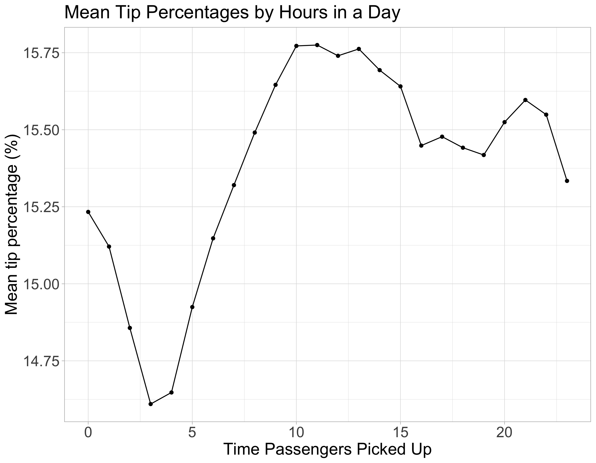
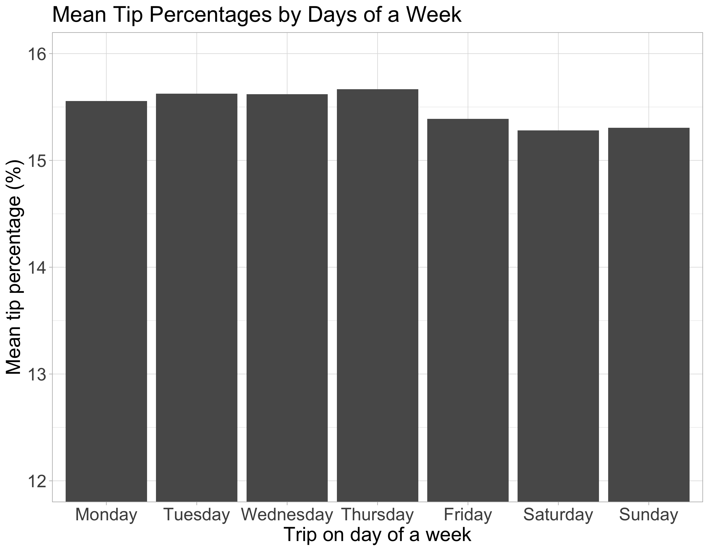

Inferential Analysis between Time of Day and Day of Week on Tip
Percentage for Taxi Rides in New York City
================
Alexander Hinton, James Huang, Jasmine Qin  
2020/01/22 (updated: 2020-02-05)

# Introduction and Aims

In this data analysis project, we are trying to answer the question of
whether the time of day, and day of the week are associated with tip
generosity of riders in New York City taxis. This is an important
question for taxi drivers, who often have autonomy on there working
schedules and therefore may find it interesting and relevant which times
of the day and week are associated with the highest average tip
percentages, and whether these differences are significant.   Our aim
for the project will be to perform an `Inferential` analysis, and to
estimate association between our independent variables of interest (time
of the day, and day of the week), and our outcome variable (tip
percentage). Our aim is not to make a causal or mechanistic claim
between any variables, however this would be an interesting area for
future work.

# Data

## Datasource

We are using a comprehensive dataset of all taxi rides from yellow and
green cabs in New York City for the month of February, 2017. The dataset
was downloaded from
[data.world](https://data.world/new-york-city/yellow-tripdata-february-2017/workspace/file?filename=yellow_tripdata_2017-02.csv),
and provided to them by the City of [New York Open Data
Portal](https://opendata.cityofnewyork.us/), which provides all New York
City public data, based on the [New York City open data
law](https://opendata.cityofnewyork.us/open-data-law/).   The data
provides many features about each observation, including: 

  - Pickup and dropoff time stamps
  - Pickup and dropoff location ID’s
  - Distance and duration of each trip
  - Fare
  - Tip
  - Payment method

The dataset could not be downloaded directly with a url, and thus had to
be reuploaded to a github repo. The size of the file greatly exceeded
the 100 MB size limit of github uploads, so the data was randomly
sampled to include 1 million observations from the original 9 million
observations. The location of the file we are using in the analysis can
be found and downloaded
[here](https://raw%20githubusercontent.com/jamesh4/yellow_tripdata_2017_02/master/taxi_smaller.csv).

## Wrangling and Exploratory Data Analysis

For our problem, we have created an additional variable called of **tip
percentage**, which is calculated as:   
  
This transformation was carried out for the main reason that most
individuals tip not in absolute terms but in percentages, and therefore
a gross value of tip is extremely correlated with the ride fare. When
using a credit or debit card to make a transaction, the tip option is
usually specified as a percentage, making it most logical that we use
tip percentage as our dependent variable. We have mapped location ID’s
from the dataset into their unique boroughs in New York City. The link
to this dataset can be found
[here](https://www1.nyc.gov/site/tlc/about/tlc-trip-record-data.page).
By reducing the location ID’s to 5 from over 200 we are improving the
parameter estimates in the modelling, as well as making them more
interpretable. We have only included rides where payment was made with a
credit card, as these are the only rides where the tip amounts were
recorded.

To further understand the data, we first visualized if there was a
relationship between hour of the day, and the mean tip
percentage.

Figure 1. Mean tip percentages by hour.

 As well as how mean tip percentage varies during the course ofa
week. 

Figure 2. Mean tip percentages by day.

From the visual inspection, and based on the analysis we wanted to carry
out, we decided to transform our time feature. Currently all rides are
recorded with a timestamp, however for our inferential analysis we
wanted to compare different time-of-day groups. We broke down a 24 hour
day into the following four segments: 

  - Morning: rides between 5:00am and 11:59am  
  - Afternoon: rides between 12:00pm and 5:59pm  
  - Evening: rides between 6:00pm and 9:59pm  
  - Middle of the night: rides between 10:00pm and 4:59am  

These groups contain an approximately equal proportion of the rides, and
could also be considered as shifts that a taxi cab driver might work.
Additionally, we have also created an indicator variable to separate
weekend and weekday rides. A final heat map of mean tip percentages
split on our time of day feature, and weekend/weekday feature can be
seen below:
 

Figure 3. Heatmap

From the heatmap we can see that mean tip percentages are highest in the
afternoon/evening, and that the relationship between time of day and tip
percentage is different between weekends and weekdays. This information
provided intuition that their appears to be an interaction effect
between time of day and day of the week, which is an important
consideration in our statistical modelling.

# Model

The question we are asking is whether there is an association between
time of day and day of the week on the mean tip percentage for taxi
rides in New York City. Before we set up our, we need to carefully
consider our problem and our relevant variables: 

**Outcome**: This is our `tip percentage` variable.   **Key
predictor**: These are the variables of interest, the `time of day`
group variable as well as `day of week`. We want to know how the
`Outcome` variable changes with this `Key Predictor` variable.  
**Confounders**: Potential variables related to both the `Key Predictor`
variable, and the `Outcome` variable. Not including these variables in
the analysis could affect the magnitude, direction and statistical
significance of the assosications we uncover between our `Key Predictor`
and `Outcome` variable. We will control for the following potential
confounding variables: `ride location` (borough), `trip distance`, and
`number of passengers`.  

Given all of our variables, we thought the best approach would be to
estimate a linear regression model, with `tip percentage` as the
dependent variable, and the `Key Predictor` and `Confounders` as the
independent variables. This model will allow for easy interpretation fo
the regression coefficients and their statistical significance, as well
as allow for flexibility in modelling interaction effects between
independent variables.

**Assumptions of Linear Regression Model**:  
\- Linearity: Relationship between predictor and mean of outcome should
be linear  
\- Independence: Taxi ride observations should be inpdependent of each
other  
\- Normality: Given predictor, tip percentage needs to be normally
distributed. Errors should also be normally distribed with zero mean and
constant variance

Given this breakdown, we estimated the following linear model:    
  
  
  Where  are the
potential confounding variables we are controlling for,
 are
the estimates of the parameters associated with those counfounders, and

are the estimates of the parameters we are interested in. Of note, we
have fit an interaction model between time of day and day of week, based
on the visual inspection of the heatmap above.

# Results

The results of our model are outputted below:  

<table class="table" style="margin-left: auto; margin-right: auto;">

<caption>

Table 1. Summary Table of Model Parameters, Dependent Variable = Mean
Tip Percentage

</caption>

<thead>

<tr>

<th style="text-align:left;">

term

</th>

<th style="text-align:left;">

estimate

</th>

<th style="text-align:left;">

std.error

</th>

<th style="text-align:left;">

statistic

</th>

<th style="text-align:left;">

p.value

</th>

</tr>

</thead>

<tbody>

<tr>

<td style="text-align:left;">

evening

</td>

<td style="text-align:left;">

\-0.0757

</td>

<td style="text-align:left;">

0.0166

</td>

<td style="text-align:left;">

\-4.56

</td>

<td style="text-align:left;">

5.16e-06

</td>

</tr>

<tr>

<td style="text-align:left;">

middle\_night

</td>

<td style="text-align:left;">

0.11

</td>

<td style="text-align:left;">

0.0192

</td>

<td style="text-align:left;">

5.75

</td>

<td style="text-align:left;">

9.02e-09

</td>

</tr>

<tr>

<td style="text-align:left;">

morning

</td>

<td style="text-align:left;">

\-0.0519

</td>

<td style="text-align:left;">

0.0163

</td>

<td style="text-align:left;">

\-3.17

</td>

<td style="text-align:left;">

0.0015

</td>

</tr>

<tr>

<td style="text-align:left;">

weekend

</td>

<td style="text-align:left;">

\-0.0477

</td>

<td style="text-align:left;">

0.0211

</td>

<td style="text-align:left;">

\-2.26

</td>

<td style="text-align:left;">

0.024

</td>

</tr>

<tr>

<td style="text-align:left;">

evening\*weekend

</td>

<td style="text-align:left;">

\-0.0418

</td>

<td style="text-align:left;">

0.0325

</td>

<td style="text-align:left;">

\-1.29

</td>

<td style="text-align:left;">

0.199

</td>

</tr>

<tr>

<td style="text-align:left;">

middle\_night\*weekend

</td>

<td style="text-align:left;">

\-0.604

</td>

<td style="text-align:left;">

0.0315

</td>

<td style="text-align:left;">

\-19.2

</td>

<td style="text-align:left;">

2.93e-82

</td>

</tr>

<tr>

<td style="text-align:left;">

morning\*weekend

</td>

<td style="text-align:left;">

0.323

</td>

<td style="text-align:left;">

0.0335

</td>

<td style="text-align:left;">

9.62

</td>

<td style="text-align:left;">

6.83e-22

</td>

</tr>

</tbody>

</table>

Note: all estimates of the potential counfounding variables are not
displayed in the table for readability.

# Discussion

## Statistical significance

Almost all of the variables of interest to us are estimated to have
statistically significant association with the outcome variable of `tip
percentage`. To understand the results table, it is important to note
the reference level group is `weekday` and `afternoon`.   Breaking
down the association analysis by day type:  

**Weekdays**: Evening and morning rides are significantly *lower* than
weekday afternoon rides, while weekday middle of the night rides are
significantly *higher* than weekday afternoon rides. These are all
significant to the 1% significance level.   **Weekends**: Weekend
rides are signficantly lower than weekday rides, at the 5% significance
level.  **Interactions**: Weekend evening (evening + weekend +
evening\*weekend) compared to weekday evening (evening) is lower, since
estimates of `weekend` and `evening weekend` are negative. This aligns
with what we observed from the heat map.

## Magnitudes

While many variables were estimated to have significant association with
the dependent variable of `tip_percentage`, the magnitudes of most
estimates are quite small. However, these magnitudes could add up to
signicant income differences over the course of a week, month or year
for a taxi driver. For instance, the difference between our estimate of
the highest time of the week (weekday middle of the night), and the
lowest expected time of the (weekend middle of the night), is:   
  
percentage points. While this may not seem like a lot, on a total fare
of $ (or an
approximate week of earnings), this would be an estimated difference of
approximately $.

## Limitations and Future Directions

Linear regression has strict assumptions on the relationship between the
predictors and the response variable, and on the distribution of errors.
Although it is reasonable to assume that tip observations are
independent from each other, they are not perfectly normally distributed
and are right-skewed. The fact that linear regression projects the
response variable to any value on the real line is also a problem here,
because tip percentages can only be non-negative values.

The non-normal errors is not a big issue here because we are using a
large dataset. When the Central Limit Theorem holds, the sampling
distribution is approximately Normal and our p-values are still valid.
We could use a generalized linear model to fit the data, but this means
that other distributional assumptions will be made to tip percentage,
and including a link function to connect the predictors and response
will make the parameter estimates less interpretable.

## Credits

This project involves the work of \[R Core Team (2019); Wickham et al.
(2019); de Jonge (2018); Grolemund and Wickham (2011); Venables and
Ripley (2002); Robinson and Hayes (2019); Wickham (2016); Auguie (2017);
Wilke (2018); Schloerke et al. (2018); Pérez and Granger. (2007); Stéfan
van der Walt and Varoquaux (2011); McKinney (2010); Vesterinen (n.d.);
Taxi and (TLC) (2017); Peng and Matsui (2017); Faraway (2014);\]

# References

Auguie, Baptiste. 2017. *GridExtra: Miscellaneous Functions for "Grid"
Graphics*. <https://CRAN.R-project.org/package=gridExtra>.

de Jonge, Edwin. 2018. *Docopt: Command-Line Interface Specification
Language*. <https://CRAN.R-project.org/package=docopt>.

Faraway, Julian J. 2014. *Linear Models with R*.
<https://people.bath.ac.uk/jjf23/LMR/>.

Grolemund, Garrett, and Hadley Wickham. 2011. “Dates and Times Made Easy
with lubridate.” *Journal of Statistical Software* 40 (3): 1–25.
<http://www.jstatsoft.org/v40/i03/>.

McKinney, Wes. 2010. *Data Structures for Statistical Computing in
Python, Proceedings of the 9th Python in Science Conference*.
<http://conference.scipy.org/proceedings/scipy2010/mckinney.html>.

Peng, Roger D., and Elizabeth Matsui. 2017. *The Art of Data Science*.
<https://bookdown.org/rdpeng/artofdatascience/#>.

Pérez, Fernando, and Brian E. Granger. 2007. *IPython: A System for
Interactive Scientific Computing, Computing in Science & Engineering*.
<https://ieeexplore.ieee.org/document/4160251>.

R Core Team. 2019. *R: A Language and Environment for Statistical
Computing*. Vienna, Austria: R Foundation for Statistical Computing.
<https://www.R-project.org/>.

Robinson, David, and Alex Hayes. 2019. *Broom: Convert Statistical
Analysis Objects into Tidy Tibbles*.
<https://CRAN.R-project.org/package=broom>.

Schloerke, Barret, Jason Crowley, Di Cook, Francois Briatte, Moritz
Marbach, Edwin Thoen, Amos Elberg, and Joseph Larmarange. 2018. *GGally:
Extension to ’Ggplot2’*. <https://CRAN.R-project.org/package=GGally>.

Stéfan van der Walt, S. Chris Colbert, and Gaël Varoquaux. 2011. *The
Numpy Array: A Structure for Efficient Numerical Computation, Computing
in Science & Engineering*.
<https://ieeexplore.ieee.org/document/5725236>.

Taxi, and Limousine Commission (TLC). 2017. *NYC Opendata*.
<https://data.cityofnewyork.us/Transportation/2017-Yellow-Taxi-Trip-Data/biws-g3hs>.

Venables, W. N., and B. D. Ripley. 2002. *Modern Applied Statistics with
S*. Fourth. New York: Springer. <http://www.stats.ox.ac.uk/pub/MASS4>.

Vesterinen, Konsta. n.d. *Python Data Validation for Humans™.*
<https://validators.readthedocs.io/en/latest>.

Wickham, Hadley. 2016. *Ggplot2: Elegant Graphics for Data Analysis*.
Springer-Verlag New York. <https://ggplot2.tidyverse.org>.

Wickham, Hadley, Mara Averick, Jennifer Bryan, Winston Chang, Lucy
D’Agostino McGowan, Romain François, Garrett Grolemund, et al. 2019.
“Welcome to the tidyverse.” *Journal of Open Source Software* 4 (43):
1686. <https://doi.org/10.21105/joss.01686>.

Wilke, Claus O. 2018. *Ggridges: Ridgeline Plots in ’Ggplot2’*.
<https://CRAN.R-project.org/package=ggridges>.

